# 📊 E-Commerce Revenue Analytics

<div align="center">

### End-to-End Data Analytics Project using Python, SQL, Excel & Power BI


</div>

---

# 🚀 Live Demo
🌐*Interactive Streamlit Dashboard:* 
https://ecommerce-revenue-analytics.streamlit.app/

---

# 📌 Project Overview

This project demonstrates a complete end-to-end Data Analytics workflow using the **Brazilian Olist E-Commerce Dataset**.

The objective was to transform raw transactional data into meaningful business insights by combining **Python, SQL, Excel and Power BI** into a single analytics pipeline.

The project follows a real-world workflow:

- Data Cleaning & Preprocessing
- Feature Engineering
- SQLite Database Creation
- SQL Business Analysis
- Python Data Visualization
- Excel Reporting
- Interactive Power BI Dashboard

The final solution enables business users to monitor sales performance, customer behaviour, product performance and operational KPIs.

---

# 🎯 Business Problem

E-commerce companies collect large amounts of transactional data every day, but raw data alone cannot support business decisions.

This project answers questions such as:

- Which product categories generate the highest revenue?
- Which customers contribute the most sales?
- Which regions perform best?
- How does revenue change over time?
- Which payment methods are most popular?
- How efficiently are orders delivered?

---

# 📂 Dataset

**Dataset:** Brazilian Olist E-Commerce Dataset

The Brazilian Olist E-Commerce Dataset is a real-world public dataset containing information on e-commerce orders placed through the Olist marketplace in Brazil between 2016 and 2018. The dataset combines transactional, customer, product, payment, review and geolocation information, making it suitable for end-to-end sales and customer analytics.

The dataset contains information about:

- Customers
- Orders
- Products
- Sellers
- Payments
- Customer Reviews
- Geolocation

Dataset Highlights:

- 99,000+ Orders
- 95,000+ Customers
- Multiple Product Categories
- Customer Locations
- Delivery Information
- Payment Records

---

# 🛠 Tech Stack

| Category | Technologies |
|-----------|--------------|
| Programming | Python |
| Data Processing | Pandas, NumPy |
| Database | SQLite |
| Query Language | SQL |
| Visualization | Plotly |
| Spreadsheet Analysis | Microsoft Excel |
| Dashboarding | Microsoft Power BI |
| Version Control | Git & GitHub |

---

# 🔄 Project Workflow

```text
Raw CSV Files
      │
      ▼
Python Data Cleaning
      │
      ▼
Feature Engineering
      │
      ▼
SQLite Database
      │
      ▼
SQL Business Analysis
      │
      ├──────────────┐
      ▼              ▼
 Plotly Charts    Excel Analysis
      │              │
      └──────┬───────┘
             ▼
      Power BI Dashboard
             ▼
      Business Insights
```

---

# 📈 Analytics Pipeline

The project follows an end-to-end analytics workflow commonly used in business intelligence projects.

1. Clean raw e-commerce data using Python.
2. Store processed data inside SQLite.
3. Perform SQL-based business analysis.
4. Generate automated Plotly visualizations.
5. Perform Excel Pivot Table analysis.
6. Build interactive Power BI dashboards.
7. Deliver actionable business insights.

---

# 📈 Python Visualizations (Plotly)

Python was used to automate business reporting by generating publication-quality visualizations directly from SQL query results using **Plotly**.

These charts provide quick insights into sales performance, customer behavior and product performance before building the final Power BI dashboard.

---

## Revenue by Product Category

Identifies the product categories contributing the highest revenue.

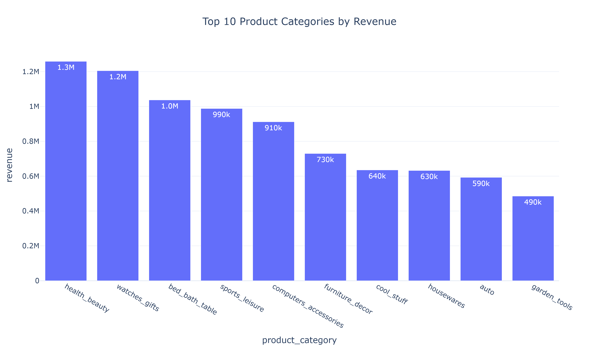

---

## Monthly Revenue Trend

Visualizes monthly sales performance to identify seasonal trends and business growth patterns.

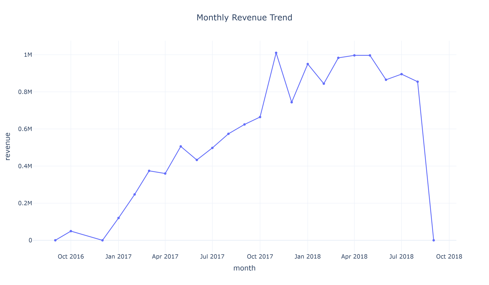

---

## Top Customers by Revenue

Highlights the customers generating the highest revenue, helping identify high-value customers.

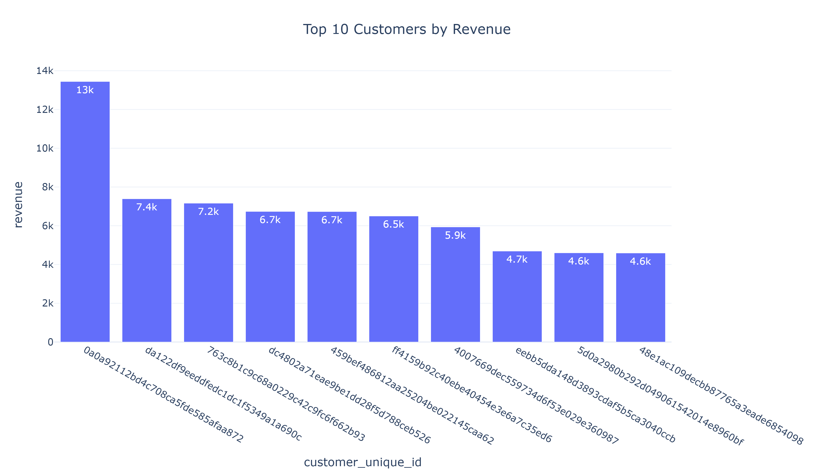

---

## Payment Method Distribution

Shows customer payment preferences across different payment methods.

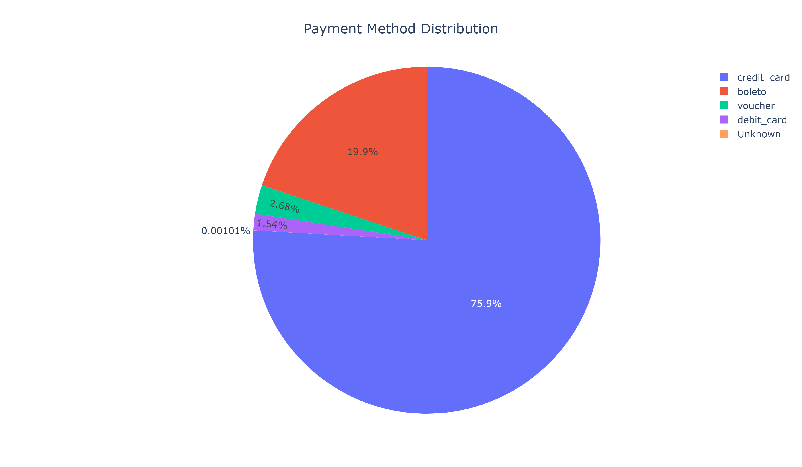

---

## Order Status Distribution

Provides an overview of order fulfillment status across all orders.

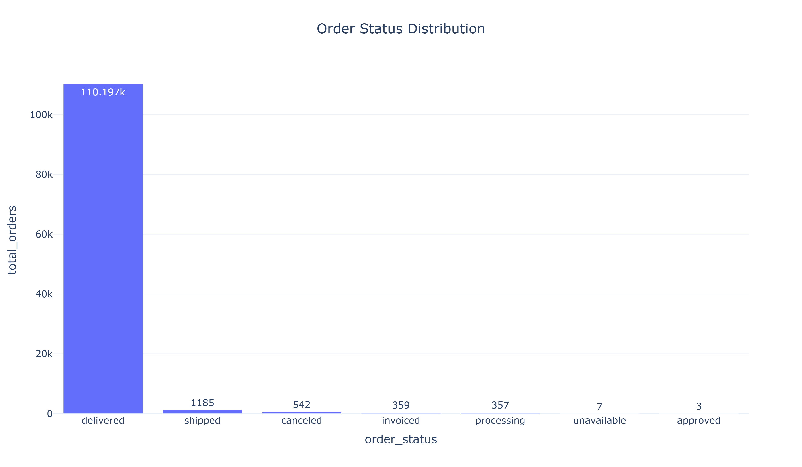

---

## Top Products by Revenue

Ranks products based on total revenue generated.

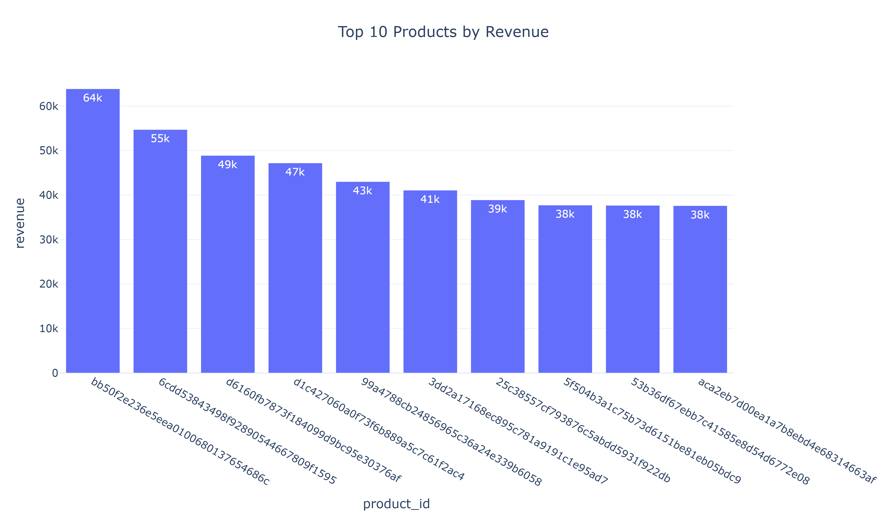

---

# 📊 Microsoft Excel Analysis

In addition to Python and SQL, Microsoft Excel was used to validate business metrics through **Pivot Tables** and **Pivot Charts**.

This demonstrates the ability to perform business reporting using one of the most widely adopted tools in the analytics industry.

---

## Revenue by Product Category

Pivot Tables and Pivot Charts were used to summarize revenue across product categories and identify top-performing categories.

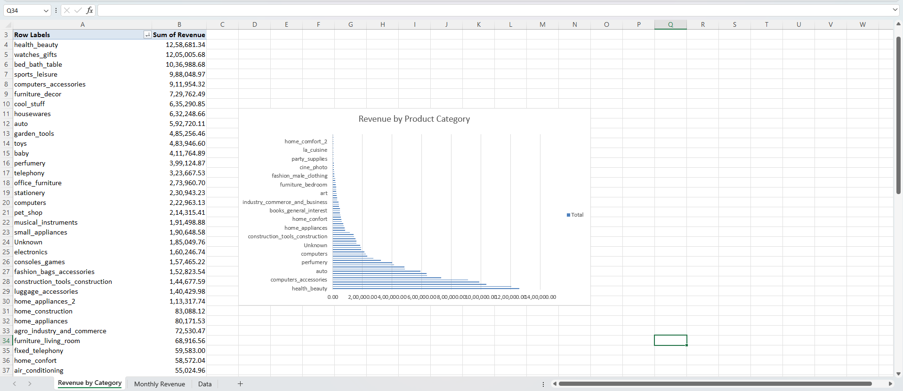

---

## Monthly Revenue Trend

Monthly sales were analyzed using Excel Pivot Tables to understand revenue patterns over time.

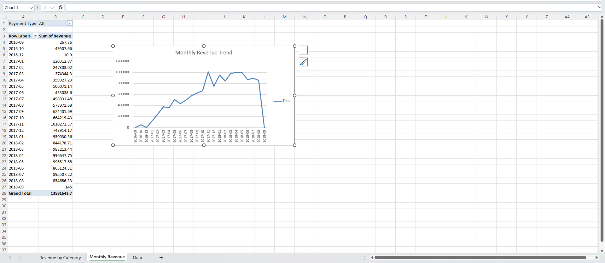

---

### Excel Skills Demonstrated

- Pivot Tables
- Pivot Charts
- Revenue Analysis
- Trend Analysis
- Business Reporting

---

### Why Multiple Tools?

Instead of relying on a single platform, the same business questions were answered using multiple analytical tools.

This approach demonstrates the ability to perform consistent analysis across:

- Python
- SQL
- Microsoft Excel
- Power BI

while ensuring that the generated insights remain accurate and reproducible.

# 📊 Interactive Power BI Dashboard

The final stage of the project was the development of a multi-page interactive Power BI dashboard.

The dashboard transforms raw transactional data into business-friendly reports, allowing stakeholders to explore sales, customers, products and operational performance through interactive visualizations and slicers.

---

# Dashboard Overview

The report is divided into four analytical pages.

---

## 🏠 Executive Overview

Provides a high-level summary of business performance.

**Key Metrics**

- Total Orders
- Total Customers
- Total Revenue
- Average Order Value

**Highlights**

- Revenue by State
- Monthly Revenue Trend
- Top Product Categories
- Interactive Filters

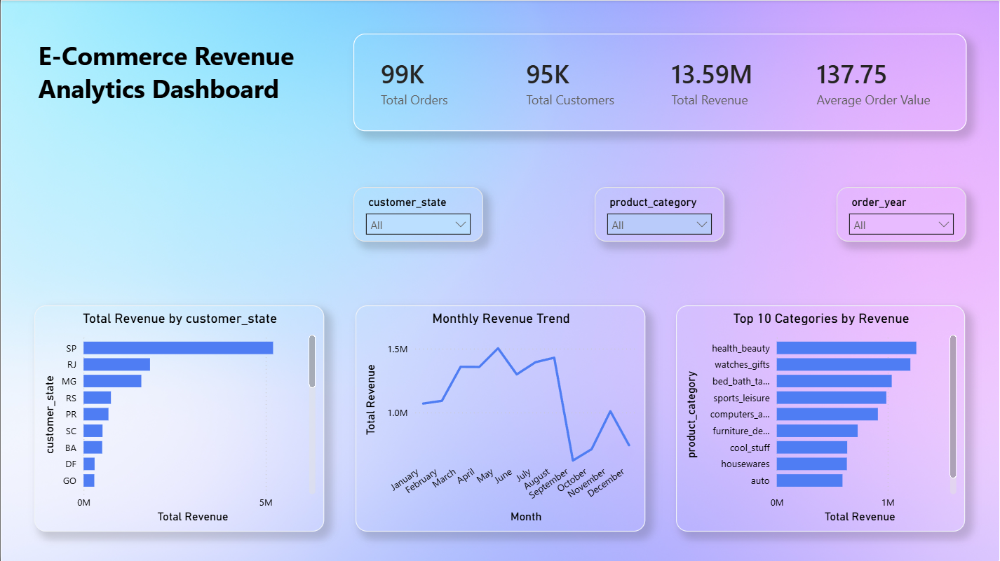

---

## 👥 Customer Analytics

Analyzes customer purchasing behaviour and revenue contribution.

**Key Metrics**

- Total Customers
- Average Order Value
- Repeat Customer Rate

**Highlights**

- Top Customers
- Top Cities
- Payment Method Distribution
- Customer Revenue Analysis

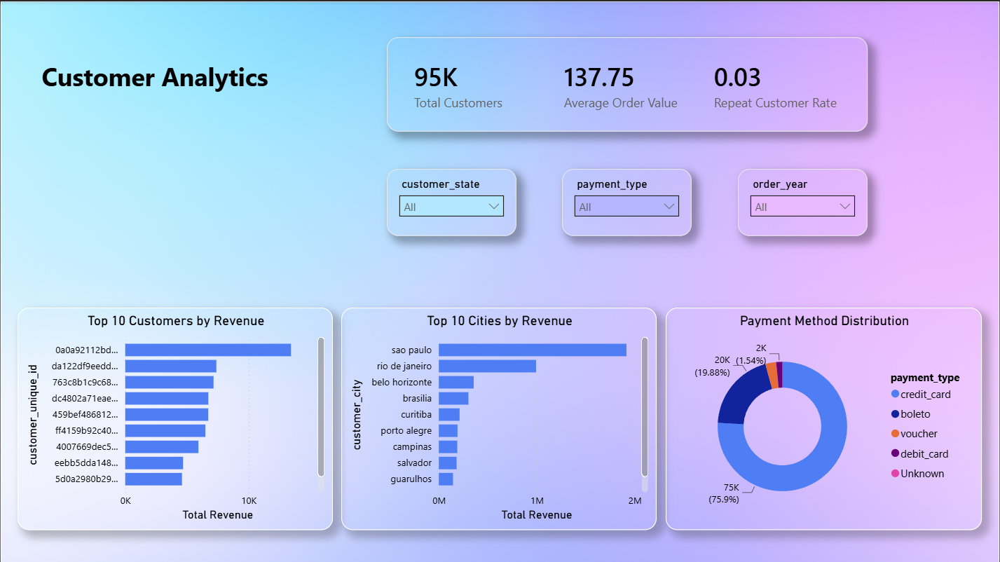

---

## 📦 Product Performance

Evaluates product sales and category performance.

**Key Metrics**

- Total Revenue
- Products Sold
- Average Product Price
- Unique Products

**Highlights**

- Top Products
- Revenue by Category
- Revenue Treemap
- Monthly Category Trends

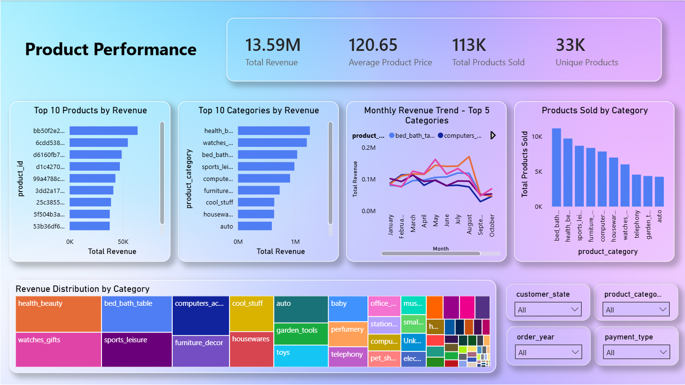

---

## 🚚 Operations & Delivery

Monitors delivery performance and operational efficiency.

**Key Metrics**

- Delivered Orders
- Delivery Rate
- Average Delivery Days
- Average Freight Cost

**Highlights**

- Order Status
- Delivery Performance
- Freight Analysis
- Delivery Trend

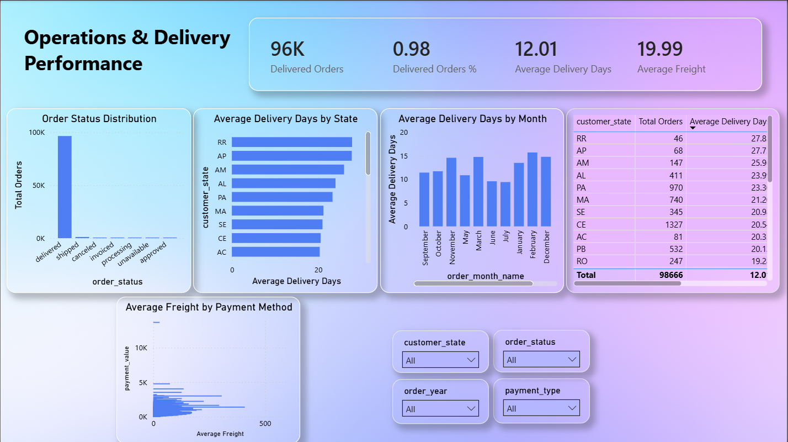

---

# ✨ Dashboard Features

The dashboard supports interactive business analysis through:

- Dynamic KPI Cards
- Interactive Slicers
- Cross-filtering
- Drill-down Visuals
- Multi-page Navigation
- Responsive Business Dashboards

---

# 💡 Key Business Insights

The analysis produced the following business insights:

### 📌 1. Health & Beauty generated the highest overall revenue.

---

### 📌 2. Revenue is concentrated within a relatively small number of product categories.

---

### 📌 3. Monthly sales demonstrate seasonal fluctuations, indicating changing customer demand throughout the year.

---

### 📌 4. A small group of customers contributes a significant share of total revenue.

---

### 📌 5. Credit Card is the most frequently used payment method.

---

### 📌 6. Sales are concentrated in a few major Brazilian states.

---

### 📌 7. Delivery performance varies across regions, highlighting opportunities to improve logistics efficiency.

---

### 📌 8. The majority of orders are successfully delivered, indicating a strong fulfillment process.

---

# 🎯 Business Value

This dashboard enables decision-makers to:

- Monitor overall business performance
- Track revenue trends
- Identify top-performing products
- Understand customer purchasing behaviour
- Evaluate payment preferences
- Analyze regional sales
- Monitor delivery performance
- Support data-driven business decisions

# 🚀 Getting Started

## Clone the Repository

```bash
git clone https://github.com/KartikeyaWarhade2002/ecommerce-revenue-analytics.git
```

Move into the project directory:

```bash
cd ecommerce-revenue-analytics
```

---

## Create a Virtual Environment

### Windows

```bash
python -m venv .venv
```

Activate the environment:

```bash
.venv\Scripts\activate
```

---

## Install Dependencies

```bash
pip install -r requirements.txt
```

---

# ▶️ Running the Project

Execute the scripts in the following order:

### 1. Prepare the Dataset

```bash
python scripts/prepare_data.py
```

### 2. Execute SQL Analysis

```bash
python sql/analysis.py
```

### 3. Generate Plotly Charts

```bash
python scripts/charts.py
```

### 4. Prepare Excel Dataset

```bash
python scripts/prep_excel.py
```

### 5. Prepare Power BI Dataset

```bash
python scripts/prep_powerbi.py
```

### 6. Launch the Streamlit Dashboard

```bash
streamlit run dashboard/app.py
```

### 7. Open the Power BI Report

Open the following file using **Microsoft Power BI Desktop**.

```
powerbi/ecommerce-revenue-analytics.pbix
```

---

# 📌 Project Highlights

✔ End-to-End Data Analytics Workflow

✔ Python Data Cleaning & Feature Engineering

✔ SQLite Database Integration

✔ SQL Business Analysis

✔ Automated Plotly Visualizations

✔ Microsoft Excel Pivot Analysis

✔ Interactive Power BI Dashboard

✔ Business KPI Development

✔ Data Storytelling & Visualization

---

# 📄 License

This project is licensed under the **MIT License**.

---

# 👨‍💻 Author

## Kartikeya Warhade

Aspiring Data Analyst passionate about transforming raw business data into actionable insights using Python, SQL, Excel and Power BI.

### Connect with Me

**GitHub**
https://github.com/KartikeyaWarhade2002

**LinkedIn**
https://www.linkedin.com/in/kartikeya-warhade/

---

<div align="center">

### ⭐ If you found this project useful, consider giving it a Star!

Thank you for visiting the repository.

</div>
